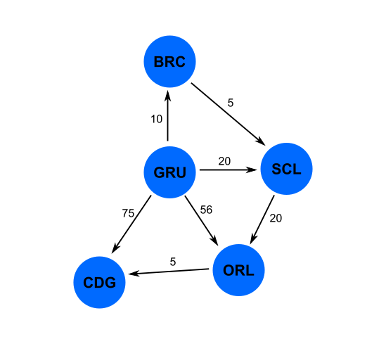

# Voos

> Aplicação _console_ e API _REST_ para escolha de rota aérea mais econômica

## Introdução

Esta aplicação foi desenvolvida com o intuíto de responder qual a rota aérea
mais econômica entre origem-destino, dado um arquivo CSV de entrada.

Para a escolha da rota foi utilizado o algorítmo de _Dijkstra_ (_Dijkstra_, _Edsger_), clássico da teoria dos grafos, cujo o objetivo é buscar o caminho, com menor custo, entre dois pontos (origem-destino) num grafo orientado ponderado, onde nesta aplicação cada vértice é representado por um aeroporto e suas arestas demonstram a ligação (orientação) de um aeroporto a outro, contendo ainda o seu custo (peso).

O arquivo CSV contém os vértices, arestas e pesos, que podemos entender como
aeroportos, suas ligações e seus custos de voos entre um aeroporto e outro.

### Um exemplo do conteúdo do arquivo CSV é demonstrado abaixo:

```
GRU,BRC,10
BRC,SCL,5
GRU,CDG,75
GRU,SCL,20
GRU,ORL,56
ORL,CDG,5
SCL,ORL,20
```

### A representação em um grafo orientado ponderado, do arquivo CSV acima, pode ser visto a seguir:



Utilizando-nos do algorítmo de _Dijkstra_ podemos afirmar que, por exemplo, a rota mais econômica entre os aeroportos GRU-CDG se dá através do caminho GRU-BRC-SCL-ORL-CDG, com o custo total da viagem de 40, pois GRU-BRC tem custo de 10, BRC-SCL tem custo de 5, SCL-ORL tem custo de 20 e por fim de ORL-CDG tem custo de 5, somados os custos chegamos ao valor de 40. 

Podemos ver no grafo que existem rotas alternativas partindo de GRU e chegando em CDG, passando por menos aeroportos, inclusive uma rota direta de GRU-CDG ao custo de 75, no entanto nenhuma outra rota neste grafo é mais econômica que a rota respondida pelo algorítmo e representada acima, com custo total de 40. Como dito, este é o objetivo do algorítmo utilizado, bem como da implementação desta aplicação.

## Requisitos para execução da aplicação

A aplicação foi desenvolvida na linguagem _Golang_ standard, não sendo necessário nenhum _framework_ ou bibliotecas externas para o seu completo funcionamento.

Para a execução da aplicação (_console_ ou _REST_) é necessário apenas ter a linguagem _Golang_ instalada, podendo ser compilada no seu sistema operacional de preferência e então tendo o binário gerado sendo executado.

É necessário o arquivo _input-file.csv_ anexo para a execução dos testes unitários pois os mesmo foram baseados nestes dados.

## Para executar a aplicação

A aplicação foi desenvolvida de forma a atender tanto a sua utilização em modo _console_ (CLI) quanto através de API _REST_. 

Para tanto é necessário informar 2 parâmetros em sua execução:

* Primeiro parâmetro refere-se ao nome do arquivo CSV de entrada.
* Segundo parâmetro refere-se a forma de utilização da aplicação, devendo este parâmetro ter como definição _console_ ou _rest_.

A seguir é demonstrado como compilar e executar a aplicação em ambos os modos.

Tome como base estar no _shell_ do seu sistema operacional de preferência e no diretório onde estão os fontes da aplicação.

**Observação:** para executar a aplicação em MS Windows o comando _go run *.go_ não funciona, sendo necessário especificar o nome de cada fonte _.go_ ou aconselho a gerar o binário executável, o que facilitará.

### Para compilar a aplicação (geração do binário executável voos)

```shell
$ go build
```

O comando acima irá gerar um binário executável da aplicação, de mesmo nome do diretório dos fontes. Supondo que os fontes estejam em _/voos_ o binário terá o nome de _voos_.

### Para executar a aplicação em modo console (CLI)

```shell
$ ./voos input-file.csv console
```

Para executar em ambiente _GNU/Linux_ ou _MacOS_, utiliza-se o _./_ seguindo do nome do binário, como exemplo _./voos_, demonstrado acima.

Em ambiente MS Windows deve-se executar apenas com o nome do binário e os parâmetros requeridos, não precisando do _./_, como:

```shell
C:\voos>voos input-file.csv console
```

### Para executar a aplicação em modo REST (API)

```shell
$ ./voos input-file.csv rest
```

## Execução em modo console

Ao executar a aplicação em modo console, esta solicitará a rota que se deseja verificar a possibilidade de voo com o menor custo possível, para tanto basta informar a rota que se deseja verificar e aguardar o retorno, como no exemplo abaixo:

```shell
$ go run *.go input-file.csv console
please enter the route: gru-cdg
best route: GRU - BRC - SCL - ORL - CDG > $40
please enter the route: scl-cdg
best route: SCL - ORL - CDG > $25
please enter the route: brc-orl
best route: BRC - SCL - ORL > $25
please enter the route: brc-cdg
best route: BRC - SCL - ORL - CDG > $30
please enter the route: ^C
$
```

Para parar a execução da aplicação em modo console tecle `<Ctrl-C>`.

Em modo console apenas é possível verificar a rota mais econômica.

## Execução em modo REST

Executando a aplicação em modo REST, será criado um servidor http que servirá as solicitações aos endpoints disponíveis para interação com a API.

Tanto retorno quanto input de dados à API, é realizado através de JSON, sendo que o input de dados à API pode ser realizado através de um array de JSON.

A API pode ser verificada utilizando-se softwares para testes/desenvolvimento de APIs, como por exemplo o Postman (www.postman.com).

Para parar a execução da aplicação em modo REST tecle `<Ctrl-C>` no _shell_ onde foi realizada a execução do serviço.


## Lista dos endpoints disponíveis (executando a aplicação em modo REST):

| Descrição                                                  | Endpoint |
| ---------------------------------------------------------- | -------- |
| Retorna os voos disponíveis                                | GET /voos/ |
| Retorna rota mais econômica entre origem-destino           | GET /voos/?rota=gru-ame|
| Atualiza arquivo CSV com novos voos ou alterações de custo | POST /voos/|

## Documentação da API

Os endpoints desenvolvidos permitem a busca de rota mais econômica entre origem-destino, visualizar todas as rotas existentes entre aeroportos e incluir novas rotas entre aeroportos, além de permitir alterar o custo de viagem em rotas pre-existentes.

Como premissa para o propósito deste desenvolvimento a API:

- Não utiliza qualquer meio de autenticação ou validação de token
- Não possui limitação de uso

### GET /voos/

Retorna todos as rotas entre aeroportos disponíveis. É uma forma de poder verificar o conteúdo do arquivo CSV que está sendo utilizado pela aplicação.

**URL e informações do recurso:**

http://localhost:3000/voos/

Formato de resposta: JSON

**Parâmetros:**

Nenhum parâmetro é requerido.

**Resposta:**

Em caso de sucesso retorna o status _"200 ok"_ com o JSON de resposta, por exemplo:

```ts
[
    {
        "origem": "GRU",
        "destino": "BRC",
        "custo": 10
    },
    {
        "origem": "BRC",
        "destino": "SCL",
        "custo": 5
    }
]
```

### GET /voos/?rota=GRU-SCL

Retorna a rota mais econômica (custo mais baixo) entre todas as rotas possíveis de origem-destino. Este endpoint devolve a mesma resposta da aplicação rodando em modo console.

**URL e informações do recurso:**

http://localhost:3000/voos/?rota=GRU-SCL

Formato de resposta: JSON ou texto puro

**Parâmetros:**

| Nome | Requerido | Descrição | Formato |
|------|-----------|-----------|---------|
| rota | Sim | Parâmetro que define a rota a ser pesquisada. | XXX-XXX |


**Resposta:**

Em caso de sucesso, retorna o status _"200 ok"_ com o JSON de resposta, por exemplo:

```ts
{
    "rota": [
        "GRU",
        "BRC",
        "SCL"
    ],
    "custo": 15
}
```

Em caso sucesso porém sem rota entre os destinos, retorna o status _"200 ok"_ com o JSON de resposta conforme abaixo:

```ts
{
    "rota": [
        "Não existe nenhum caminho de SCL para GRU"
    ],
    "custo": 0
}
```

Em caso de insucesso, retorna o status _"400 Bad Request"_, com o texto informativo de qual foi o problema, por exemplo: _"Aeroporto de origem inválido"_, _"Aeroporto de destino inválido"_, _"Rota inválida. Use XXX-XXX"_


### POST /voos/

Permite inserir novas rotas entre aeroportos (novos registros), além de permitir alterar o valor de custo de rotas pre-existentes no arquivo CSV.

**URL e informações do recurso:**

http://localhost:3000/voos/

Formato de resposta: Texto puro

**Parâmetros:**

O endpoint espera por um JSON de entrada contendo as informações dos novos destinos ou sobre a alteração de custo de destinos existentes, como exemplo:

```ts
[
    {
        "origem": "GRU",
        "destino": "AME",
        "custo": 89
    },
    {
        "origem": "CDG",
        "destino": "AME",
        "custo": 24
    },
    {
        "origem": "ORL",
        "destino": "CDG",
        "custo": 11
    }
]
```

Neste exemplo teríamos registro(s) sendo inserido (caso não existissem previamente no arquivo CSV) e registro(s) tendo seu custo atualizado (caso já existisse registro(s) no arquivo CSV).

**Resposta:**

Em caso de sucesso retorna o status _"200 ok"_ com o texto _"Rotas atualizadas com sucesso"_

## Executando os testes unitários

Em uma janela do _shell_ do seu sistema operacional, coloque a aplicação para executar em modo _REST_, para termos tanto o modo _console_ quanto a API disponível para testarmos.

Abra outra janela do _shell_, vá ao diretório dos fontes da aplicação e execute o comando abaixo:

```shell
$ go test -v
```

Este comando executará os testes unitários tanto no modo _console_ quanto no modo _REST_

Os testes serão realizados contra o arquivo _input-file.csv_ anexo a esta solução.

Espera-se o resultado semelhante ao abaixo, demonstrando passar em todos os testes:

```shell
$ go test -v
=== RUN   TestConsole
--- PASS: TestConsole (0.00s)
=== RUN   TestGetVoosTodasRotas
--- PASS: TestGetVoosTodasRotas (0.00s)
=== RUN   TestGetVoosPorRota
--- PASS: TestGetVoosPorRota (0.00s)
=== RUN   TestPostVoosNovaRota
--- PASS: TestPostVoosNovaRota (0.00s)
PASS
ok  	_/home/usuario/voos	0.003s
```

## Estrutura dos arquivos/pacotes

A solução está embasada em 7 arquivos fontes, são eles:

* _disjkstra.go:_ responsável pelo algorítmo de _Dijkstra_.
* _CSV.go:_ responsável pela manipulação de arquivos CSV.
* _console.go:_ cuida da implementação da aplicação em modo console.
* _rest.go:_ disponibiliza a API REST para uso da aplicação neste contexto.
* _voos.go:_ módulo principal da aplicação, porta de entrada de execução da mesma.
* _console_test.go:_ cuida da implementação dos testes unitários da aplicação em modo _console_.
* _rest_test.go:_ cuida da implementação dos testes unitários da aplicação em modo _rest_.

A aplicação foi modularizada em arquivos separados por funcionalidades, porém dentro de um único pacote, assim sendo, não reutilizável.

Caso seja necessário modularizar com pacotes reutilizáveis, será de fácil adaptação e neste caso os arquivos _dijkstra.go_ e _CSV.go_ seriam os quais são passíveis de modularização para reuso.

Os arquivos _voos.go_, _console.go_ e _rest.go_ são exclusivos para o funcionamento desta aplicação.

## Design da aplicação

Para o desenvolvimento da solução foi escolhida a linguagem _Golang_ por ser uma linguagem entre as mais modernas, rápida por ser compilada, de fácil leitura do código fonte para eventuais manutenções, entre outras boas características desta linguagem.

Não foram utilizados _frameworks_ ou bibliotecas externas pois a linguagem _Golang_ standard já tem os recursos necessários para a construção exigida. Existem _frameworks_ como o _Gorilla Mux_ que auxiliaria a construção da API REST, mas de qualquer forma os recursos nativos dão conta do recado de forma primorosa.

Muitas funções necessárias na aplicação foram definidas de forma a realizar pequenas tarefas, garantindo assim a sua reutilização entre as funcionalidades existentes, tais como as validações que são compartilhadas entre os módulos console e REST.

Para o desenvolvimento foi utilizada a versão 1.15.5 da Golang.

